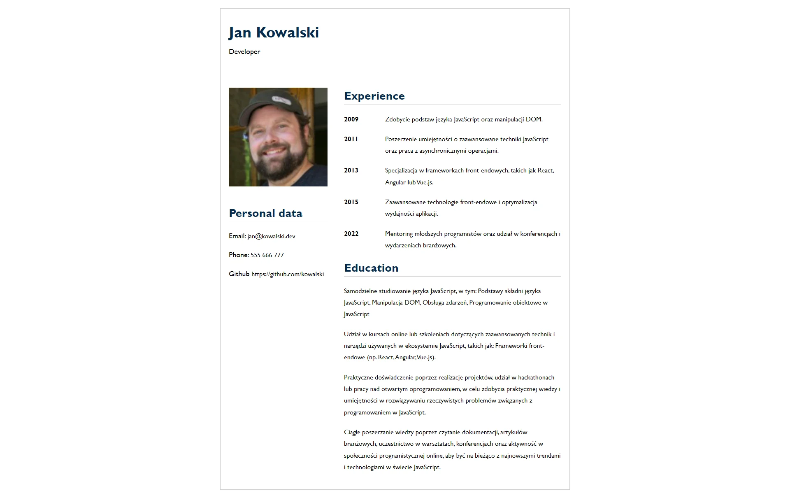

# MegaK - Kurs React

Projekt CV z kursu MegaK. Dzięki temu projektowi uczestnicy kursu mogą przećwiczyć swoje umiejętności w praktyce, tworząc jednocześnie profesjonalne portfolio, które może im pomóc w osiągnięciu swoich zawodowych celów.

## Table of contents

- [MegaK - Kurs React](#megak---kurs-react)
  - [Table of contents](#table-of-contents)
  - [Overview](#overview)
    - [Screenshot](#screenshot)
    - [Links](#links)
    - [Built with](#built-with)
  - [Author](#author)

## Overview

### Screenshot

### Links

- Solution URL: [GitHub](https://github.com/maciej-szeremeta/myCV)

### Built with

- React
- Vite
- SCSS
- Grid

## Author

- MegaK - [@Nick JS]